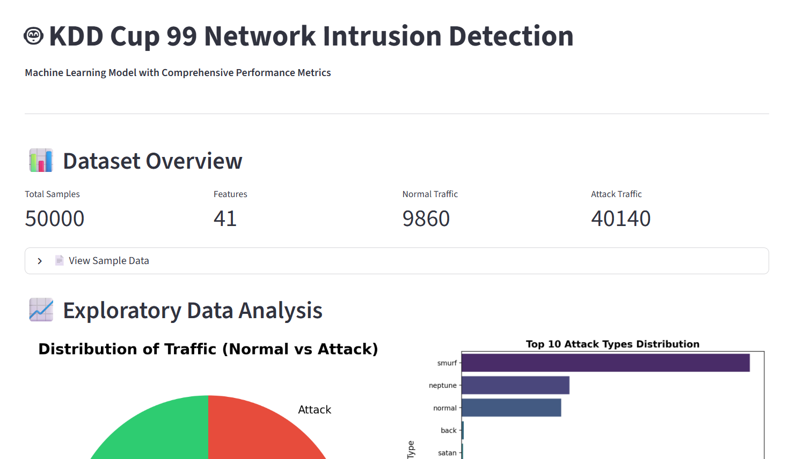

# Intrusion-detection-system
A machine learning and Streamlit-based Intrusion Detection System for identifying network attacks using the KDD Cup 1999 dataset.
## Streamlit-Based Intrusion Detection System using KDD Cup 1999 Dataset
This project is a machine learning and Streamlit-based Intrusion Detection System designed to classify normal and malicious network traffic. It uses the KDD Cup 1999 dataset to train the model and provides an interactive user interface for predicting possible cyber attacks.
## Dataset
This project uses the **KDD Cup 1999 Intrusion Detection Dataset** for training and evaluating the intrusion detection model.

- Kaggle Source: [KDD Cup 1999 Data](https://www.kaggle.com/datasets/kavl31/kdd-cup-1999-data)
- Original Source: [UCI Machine Learning Repository - KDD Cup 1999 Data](https://archive.ics.uci.edu/dataset/130/kdd+cup+1999+data)

The dataset contains network connection records with multiple features used to classify traffic as normal or malicious.
## Application Screenshot

